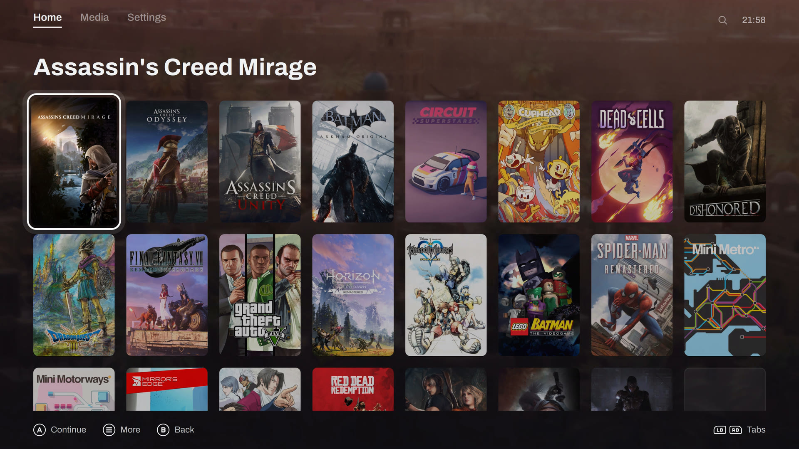
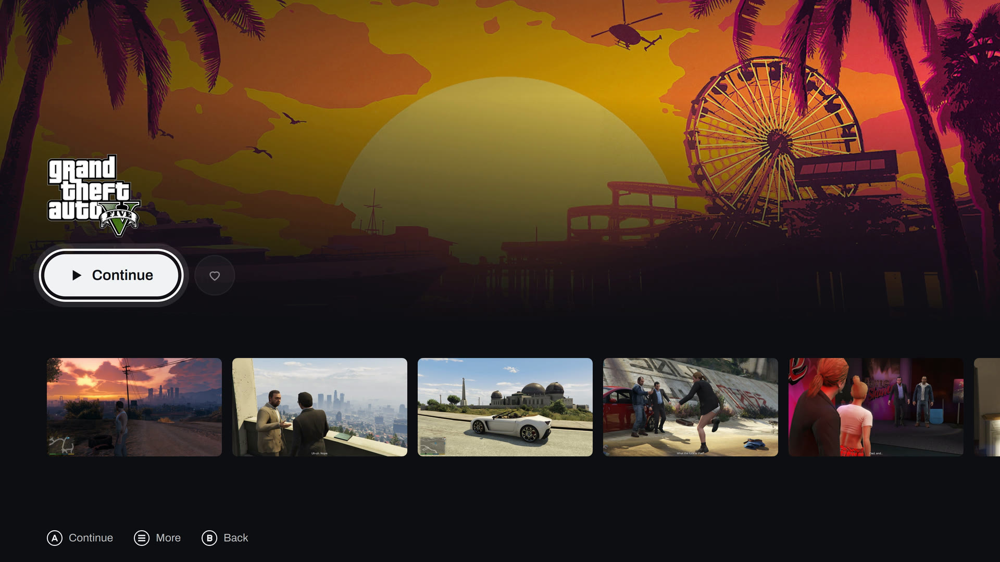
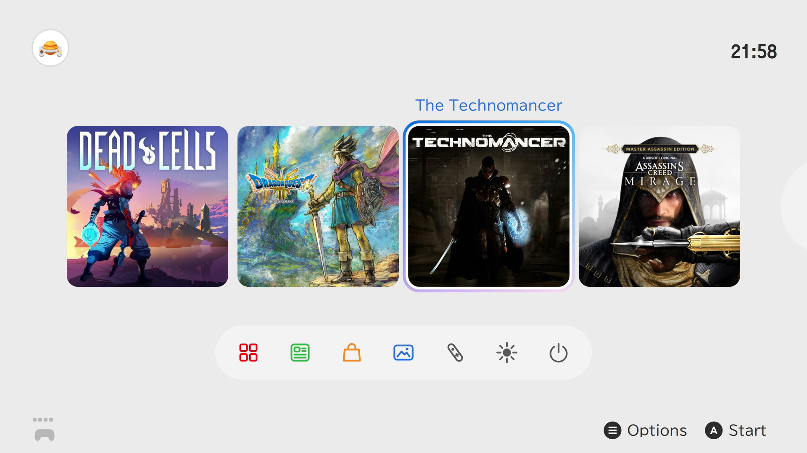

<p align="center">
  <picture>
    <source media="(prefers-color-scheme: dark)" srcset="brand/universe-lockup-dark.svg">
    
  </picture>
</p>

<p align="center">A game launcher for Linux you drive with a controller, from the couch or on a Steam Deck.</p>

<p align="center"></p>

Your GOG, Steam, Epic, itch.io, Lutris and emulated games in one library, each launched in gamescope with the runner it needs.

> [!WARNING]
> Early days (0.0.x). I use it every day, but expect rough edges. Issues are welcome.

## Your whole library

GOG, Steam, Epic and itch.io installs and updates, your Lutris games with their play time, the ROM folders your emulators already know.



## A page for every game

Art, screenshots, play time, achievements, saves and what it takes on disk.



## Three looks

Reprise, a port of my [Pegasus theme](https://github.com/ilyasturki/pegasus-theme-reprise), a Switch 2 style HOME menu, or a PS5 style home. Switch live from the settings.



Not affiliated with Nintendo or Sony. Nintendo Switch is a trademark of Nintendo; PlayStation and PS5 are trademarks of Sony Interactive Entertainment.

## Also

- HOME over a running game: pause, screenshot, MangoHud, volume, quit.
- Opt-in session recording; recordings and screenshots land in the Media tab.
- Pad, keyboard, mouse or touch, with a guided button setup; each emulator gets its own pad per player.
- Achievements, with unlock banners in game.
- Save backups after every session, restored or exported from the game's page, and a storage page of what each game takes.
- Runner builds and tools installed, updated and rolled back from the settings.
- Steam Deck controls, and it runs inside Steam's Game Mode.
- Hold B for the power menu: suspend, reboot, power off.
- Runs on GNOME, KDE, Cinnamon, Sway, Hyprland, Niri or X11.
- Universe Desktop, a GTK app for mouse and keyboard, with a GNOME search provider for your games.
- A `universe` CLI for everything the UI does.

## Install

x86_64 Linux with a systemd user session and Python 3.11 to 3.14 (on Fedora 45, whose python3 is 3.15, `sudo dnf install python3.14` first). gamescope is optional but on by default.

**Arch Linux** (AUR): `universe` builds the latest release, `universe-bin` installs its prebuilt build, `universe-git` builds `main`. `universe-desktop`, `universe-desktop-bin` and `universe-desktop-git` add Universe Desktop, the GTK app for mouse and keyboard, to each.

```sh
paru -S universe
```

**Fedora 44 and newer** (COPR): `universe` and `universe-desktop`, built from each release against Fedora's PySide6, GTK and libadwaita.

```sh
sudo dnf copr enable ilyasturki/universe
sudo dnf install universe universe-desktop
```

**SteamOS, Bazzite and other distros**: the latest release, installed for your user under `~/.local`. It asks for your password once, to put the pad rules under `/etc` and the login session's files (its entry, and the helper that installs gamescope, MangoHud and gpu-screen-recorder in it with no prompt) in place; on a Steam Deck, set one with `passwd` first. Without sudo it prints the commands to run as root instead.

```sh
curl -fsSL https://github.com/ilyasturki/universe/releases/latest/download/install.sh | sh
```

`sh -s -- --uninstall` in place of `sh` removes it.

**From a checkout** (needs cargo), installed the same way:

```sh
git clone https://github.com/ilyasturki/universe
cd universe
./install.sh
```

`./install.sh --uninstall` removes it and keeps your config, library and recordings.

**Nix** (flake): the Home Manager module installs the CLI, the UI, Universe Desktop and the GNOME Shell extension; the NixOS module sets up the system side (gpu-screen-recorder, uinput and udev rules for pads, gamescope).

```nix
# flake.nix
inputs.universe.url = "github:ilyasturki/universe";

# NixOS configuration
imports = [ inputs.universe.nixosModules.default ];
programs.universe.enable = true;
programs.universe.session.enable = true; # optional: the Universe login session

# Home Manager configuration
imports = [ inputs.universe.homeModules.default ];
programs.universe.enable = true;
```

## The Universe session

The Arch and Fedora packages and `install.sh` add a **Universe** session to the login screen (GDM, SDDM and the others). Log in to it and the launcher has the whole screen, like SteamOS's Game Mode, with no desktop behind it; Log out, in its power menu, returns to the login screen. It has no lock screen, and no Wi-Fi or Bluetooth settings yet, so connect and pair from a desktop session first. On NixOS, set `programs.universe.session.enable`; `services.displayManager.defaultSession = "universe"` with an autologin boots straight into it.

## First run

Open **Universe** from your app menu. With an empty library a short setup runs once per machine, in either app: it adds the games other launchers already installed (Lutris, Steam, Heroic, itch.io, your emulators' folders), signs you in to your stores, asks where new games install, sets your controller and HDR, and installs the runners your games need.

## Docs

- [`docs/api.md`](docs/api.md): the core, the CLI, config, modules and sources
- [`docs/frontends.md`](docs/frontends.md): how the UI is built, and how to write another frontend
- [`CHANGELOG.md`](CHANGELOG.md): what each release changed, also under Settings › About in both apps

## License

[MIT](LICENSE)
