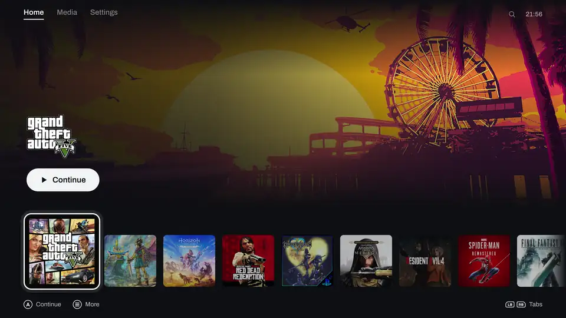

<p align="center">
  <picture>
    <source media="(prefers-color-scheme: dark)" srcset="brand/universe-lockup-dark.svg">
    
  </picture>
</p>

<p align="center">A game launcher for Linux you drive with a controller, from the couch or on a Steam Deck.</p>

<p align="center"></p>

Your GOG, Lutris and emulated games in one library, each launched in gamescope with the runner it needs.

> [!WARNING]
> Early days (0.0.x). I use it every day, but expect rough edges. Issues are welcome.

## Your whole library

GOG installs and updates, your Lutris games with their play time, the ROM folders your emulators already know.


## A page for every game

Art, screenshots, play time, achievements.


## Two looks

Reprise, a port of my [Pegasus theme](https://github.com/ilyasturki/pegasus-theme-reprise), or a Switch 2 style HOME menu. Switch live from the settings.


## Also

- HOME over a running game: pause, screenshot, MangoHud, volume, quit.
- Opt-in session recording; recordings and screenshots land in the Media tab.
- Pad, keyboard, mouse or touch, with a guided button setup.
- Steam Deck controls, and it runs inside Steam's Game Mode.
- A `universe` CLI for everything the UI does.

## Install

x86_64 Linux with a systemd user session and Python 3.11 to 3.14. gamescope is optional but on by default.

**Arch Linux** (AUR): `universe` builds the latest release, `universe-bin` installs its prebuilt build, `universe-git` builds `main`.

```sh
paru -S universe
```

**From a checkout** (needs cargo), installed for your user under `~/.local`, no root:

```sh
git clone https://github.com/ilyasturki/universe
cd universe
./install.sh
```

`./install.sh --uninstall` removes it and keeps your config, library and recordings.

**Nix** (flake): the Home Manager module installs the CLI, the UI and the GNOME Shell extension; the NixOS module sets up the system side (gpu-screen-recorder, uinput and udev rules for pads, gamescope).

```nix
# flake.nix
inputs.universe.url = "github:ilyasturki/universe";

# NixOS configuration
imports = [ inputs.universe.nixosModules.default ];
programs.universe.enable = true;

# Home Manager configuration
imports = [ inputs.universe.homeModules.default ];
programs.universe.enable = true;
```

## First run

Open **Universe** from your app menu. With an empty library it imports what it finds, installs the runners it needs and signs you in to GOG.

## Docs

- [`docs/api.md`](docs/api.md): the core, the CLI, config, modules and sources
- [`docs/frontends.md`](docs/frontends.md): how the UI is built, and how to write another frontend

## License

[MIT](LICENSE)
