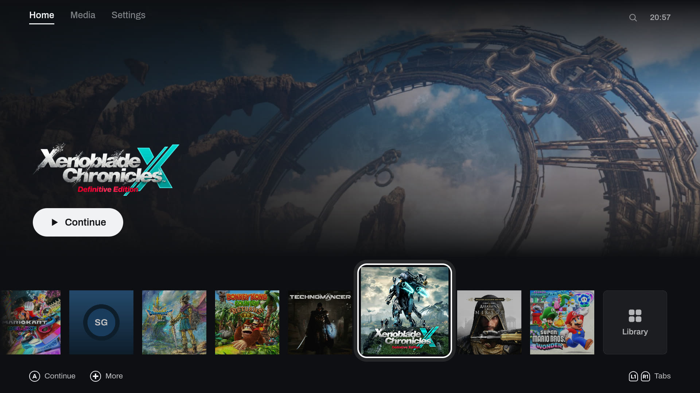
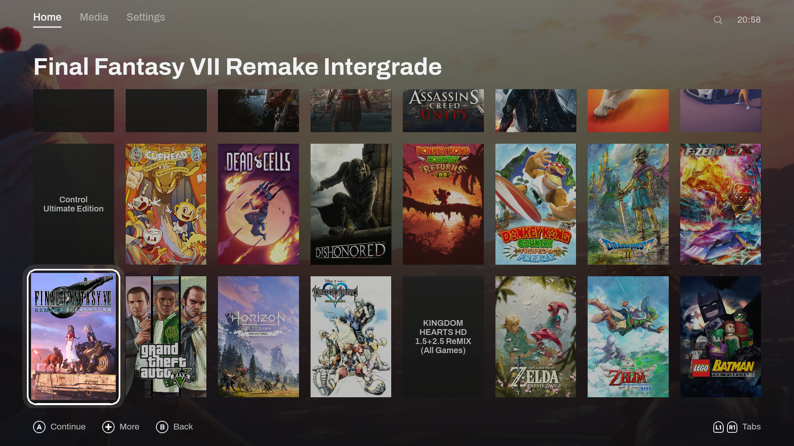
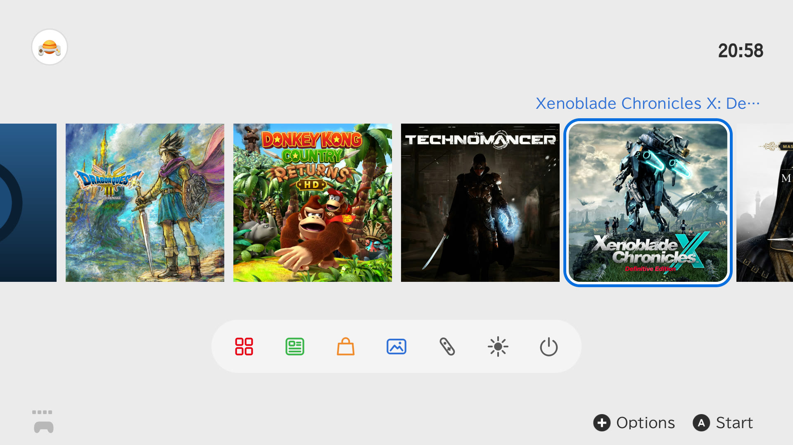

<p align="center">
  <picture>
    <source media="(prefers-color-scheme: dark)" srcset="brand/universe-lockup-dark.svg">
    
  </picture>
</p>

<p align="center">A game launcher for Linux you drive with a controller, from the couch or on a Steam Deck.</p>



Universe puts your GOG games, your emulated games and anything else you add in one library, and launches each one inside gamescope with the runner it needs. Press HOME during a game and it freezes under a dock. Play time is counted per game, and with the capture and screenshot modules on, every session is recorded on your machine.

> [!WARNING]
> Universe is young (0.0.x). I use it every day, but parts of it haven't been tested beyond my own setup, and things will break. Issues are welcome.

## What it does

- GOG games install and update through your account, with their achievements. Your Lutris library comes over with its play time, the ROM folders your emulators already list are picked up (Dolphin, Eden, Ryujinx, RPCS3, PCSX2, DuckStation, Cemu, shadPS4, Flycast), and `universe add` takes any other game.
- Games run on Proton, Wine or natively, or through one of 21 other runners, from Dolphin and RPCS3 to ScummVM and MAME. Missing Proton, Wine and emulator builds install from the Components page.
- Each game is its own systemd unit inside gamescope. If the launcher closes or crashes, the game goes down with it and the session is still counted.
- The HOME dock over a running game has resume, screenshot, achievements, MangoHud, the frame limit, volume and quit.
- Recordings (gpu-screen-recorder), screenshots and play journals end up in the Media tab.
- Every screen works with a pad, a keyboard, a mouse or touch. There is a guided button setup and a live test for Steam Deck, DualSense, DualShock 4, Xbox, Switch Pro and 8BitDo pads, and emulators get their controller config written before each launch. Pad batteries show next to the clock.
- On a Steam Deck it reads the model and exposes brightness, refresh rate, TDP, GPU clock and fan. Added to Steam as a non-Steam game, it runs inside Game Mode and leaves power, sound and the overlay to Steam.
- The UI and the `universe` CLI call the same Rust core, and every command takes `--json`.

## Two looks

Reprise, a port of my [Pegasus theme](https://github.com/ilyasturki/pegasus-theme-reprise), and a HOME menu in the style of the Switch 2. Switch between them live from the settings.





## Install

x86_64 Linux with a systemd user session and Python 3.11 to 3.14. gamescope is optional but on by default.

**From a checkout** (needs cargo), installed for your user under `~/.local`, no root:

```sh
git clone https://github.com/ilyasturki/universe
cd universe
./install.sh
```

`./install.sh --uninstall` removes it and keeps your config, library and recordings.

**Nix** (flake): the Home Manager module installs the CLI, the UI and the GNOME Shell extension; the NixOS module sets up the system side (gpu-screen-recorder, uinput and udev rules for pads, gamescope).

```nix
# flake.nix
inputs.universe.url = "github:ilyasturki/universe";

# NixOS configuration
imports = [ inputs.universe.nixosModules.default ];
programs.universe.enable = true;

# Home Manager configuration
imports = [ inputs.universe.homeModules.default ];
programs.universe.enable = true;
```

## First run

Open **Universe** from your app menu, or run `universe-ui`. With an empty library it walks you through the rest: it imports what it finds from other launchers and your emulators' ROM folders, installs the runners they need, signs you in to GOG with a QR code, and asks which controller you use.

From a terminal:

```sh
universe login gog          # sign in to GOG
universe migrate --apply    # import your Lutris library
universe module enable capture   # record every session
universe doctor             # what's missing on this machine
```

## Docs

- [`docs/api.md`](docs/api.md): the core, the CLI, config, modules and sources
- [`docs/frontends.md`](docs/frontends.md): how the UI is built, and how to write another frontend

## License

[MIT](LICENSE)
